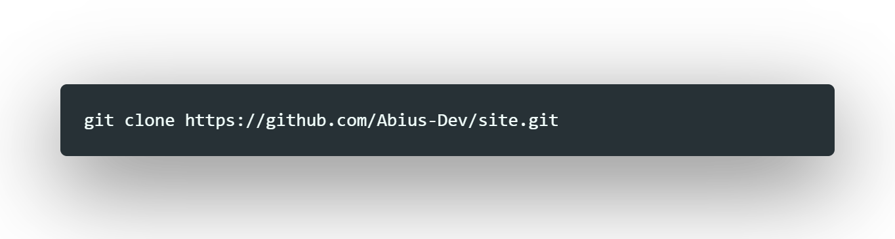
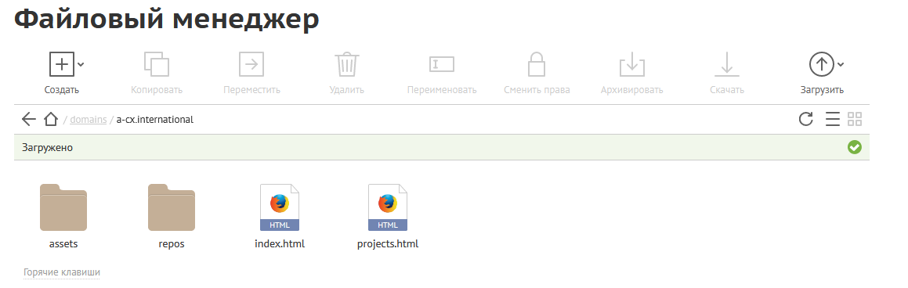

<!-- Заполни чуть позже в VS ->
<!-- VS поломался :( ->
<!-- Починил VS Code ->

 
<!-- Таблички. Включать только когда репозиторий публичный -->

[![Contributors][contributors-shield]][contributors-url]
[![Forks][forks-shield]][forks-url]
[![Issues][issues-shield]][issues-url]
[![License][license-shield]][license-url]

<!-- Логотип -->

 

  

  <h3 align="center">Изделие №001</h3>

  

    Красивая индексная страница. Разработана в Abius CompleX!
     
    <a href="https://github.com/Abius-Dev/site"><strong>Посмотреть исходный код »</strong></a>
     
     
    <a href="https://a-cx.international/">Демонстрация</a>
    ·
    <a href="https://github.com/Abius-Dev/site/issues">Сообщить о проблеме/вопросе</a>
    ·
    <a href="https://github.com/Abius-Dev/site/issues">Запросить функцию</a>
  

<!--  

  <!--   
  Это на случай, если мы хотим слив информации о новом проекте. В прочем, нами скорее всего не заинтересуются и это лишь скрытое от многих послание для тех, кто действительно нас ценит->

  
  </a>

  <h3 align="center">Изделие №1</h3>

  

    Создано для того, чтобы у нас была хорошая индексная страница. Разработано в Abius CompleX!
     
    <a href="https://github.com/Abius-Dev/site"><strong>Посмотреть документы »</strong></a>
     
     
    <a href="https://github.com/Abius-Dev/site">Демонстрация</a>
    ·
    <a href="https://github.com/Abius-Dev/site/issues">Сообщить о проблеме/вопросе</a>
    ·
    <a href="https://github.com/Abius-Dev/site/issues">Запросить функцию</a>
  

 -->

<!-- Содержание -->

  
Содержание

  <ol>
    <li>
      <a href="#about-the-project">О проекте</a>
      <ul>
        <li><a href="#built-with">Построено с ...</a></li>
      </ul>
    </li>
    <li>
      <a href="#getting-started">Старт</a>
      <ul>
<!--        <li><a href="#prerequisites">Text</a></li> -->
        <li><a href="#installation">Установка</a></li>
      </ul>
    </li>
<!--    <li><a href="#usage">Использование</a></li> -->
    <li><a href="#roadmap">В процессе разработки</a></li>
<!--    <li><a href="#contributing">Contributing</a></li> -->
    <li><a href="#license">Лицензия</a></li>
    <li><a href="#contact">Контакты</a></li>
    <li><a href="#acknowledgments">Благодарности</a></li>
  </ol>

<!-- О проекте -->
## О проекте

[![Демонстрация Изделия №001][product-screenshot]](.github/774853bd-a746-4362-9c05-190055132169.url-0001.PNG)

Это изделие было создано в Abius CompleX для того, чтобы привнести некоторые изменения и улучшения.

Преимущества:
1. Уникальный дизайн
2. Адаптировано под разные домены
3. Сделано в Bootstrap Studio
4. Сделано при помощи Bootstrap 5

(<a href="#top">Наверх</a>)

### Построено с ...

На чём это построено
 * [HTML](https://ru.wikipedia.org/wiki/HTML)
 * [CSS](https://ru.wikipedia.org/wiki/CSS)
 * [JS](https://ru.wikipedia.org/wiki/JavaScript)
 * [Google Fonts](https://fonts.google.com/)
 * [Bootstrap](https://getbootstrap.com)
 * [JQuery](https://jquery.com)

Программы использованные в разработке
 * [Bootstrap Studio](https://bootstrapstudio.io/)
 * [Visual Studio Code](https://code.visualstudio.com/)

(<a href="#top">Наверх</a>)

<!-- ### АБВ -->

<!-- Старт -->
## Старт

Достаточно просто переместить файлы в папку Вашего веб-сервера.

### Установка (Версия только на Bootstrap)

1. Установите (В дальнейшем добавить в чём разрабатывалось)
2. Скопируйте репозиторий 

3. Выложите файлы на Ваш сервер

<!-- 
(<a href="#top">Наверх</a>)
 -->

<!-- Примеры использования -->
<!-- ## Примеры использования

Заполнить после разработки проекта. Добавить скриншоты, примеры кода и демонстрацию с каждой платформы (включая сайт). -->

<!-- _Составить HTML [документацию](http://???/public_doc/index.html)_ -->

<!-- 
(<a href="#top">Наверх>)
 -->

<!-- To-Do -->

## В процессе разработки...

 [x] Сделать красивый readme
* [x] Сделать главную индексную страницу (Базовый уровень)
   * [x] Главная индексная страница
   * [x] Страница с проектами
* [] Сделать ГлИнСтр (Расширенно/Подробно)
   * [] Главная индексная страница
        * [] Логотип
        * [] Кто мы такие?
        * [] Чем мы занимаемся?
        * [] Какова наша цель?
        * [] Какова наша идеология?
        * [] Наши проекты
        * [] Наши планы
        * [] Сотрудники
        * [] Контакты
   * [] Проекты
        * [] ASNv2
        * [] ASNv3
        * [] ASN EcoSystem
        * [] AOS II [2021]
   * [] Какова наша цель?
        * [] Развитие 
            * [] Пункт 1
            * [] Пункт 2
            * [] Пункт 3
        * [] Уничтожение
            * [] Пункт А
            * [] Пункт Б
    * [] Наша идеология
        * [] Не наша идеология
        * [] Подробнее о кибернетическом обществе
* [] Оптимизация под мобильные устройства
* [] Написать CMS
   * [] FrontEnd (Bootstrap)
   * [] BackEnd ()
   * [] Подключение к базе данных MySQL
   * [] Соединить всё
* [] Улучшить материал
* [] Подготовиться к защите этого проекта

Смотрите [открытые Issue](https://github.com/Abius-Dev/site/issues) для того, чтобы узнать больше функций (и известные Issue).

<!-- 
(<a href="#top">Наверх</a>)
 -->

<!-- Лицензия -->
## Лицензия проекта

Находится под лицензией GNU GPL-2. Смотрите `LICENSE.txt` для большего количества информации.

(<a href="#top">Наверх</a>)

<!-- Контакты -->
## Контакты

* Евгений Костенко - kostenko@a-cx.ml

Ссылка на проект: [https://github.com/Abius-Dev/site](https://github.com/Abius-Dev/site)

(<a href="#top">Наверх</a>)

<!-- Благодарность данным сервисам -->
## Благодарности

Огромная благодарность этим ресурсам!

* [Choose an Open Source License](https://choosealicense.com)
* [GitHub Emoji Cheat Sheet](https://www.webpagefx.com/tools/emoji-cheat-sheet)
* [Malven's Flexbox Cheatsheet](https://flexbox.malven.co/)
* [Malven's Grid Cheatsheet](https://grid.malven.co/)
* [Img Shields](https://shields.io)
* [GitHub Pages](https://pages.github.com)
* [Font Awesome](https://fontawesome.com)
* [React Icons](https://react-icons.github.io/react-icons/search)

(<a href="#top">Наверх</a>)

<!-- Ссылки и изображения из этого файла -->
<!-- https://www.markdownguide.org/basic-syntax/#reference-style-links -->
[contributors-shield]: https://img.shields.io/github/contributors/Abius-Dev/site.svg?style=for-the-badge
[contributors-url]: https://github.com/Abius-Dev/site/graphs/contributors
[forks-shield]: https://img.shields.io/github/forks/Abius-Dev/site.svg?style=for-the-badge
[forks-url]: https://github.com/Abius-Dev/site/network/members
[stars-shield]: https://img.shields.io/github/stars/Abius-Dev/site.svg?style=for-the-badge
[stars-url]: https://github.com/Abius-Dev/site/stargazers
[issues-shield]: https://img.shields.io/github/issues/Abius-Dev/site.svg?style=for-the-badge
[issues-url]: https://github.com/Abius-Dev/site/issues
[license-shield]: https://img.shields.io/github/license/Abius-Dev/site.svg?style=for-the-badge
[license-url]: https://github.com/Abius-Dev/site/blob/master/LICENSE
[product-screenshot]: images/screenshot.png
